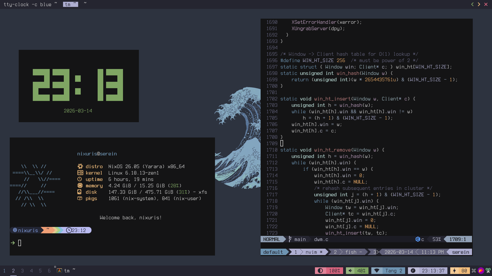

# Serein Window Manager
A fully statically linked X11 window manager. Built with a Go core and a high-performance C engine via CGO.



## Installation

### Download Binary (Recommended)
Since `srwm` is built as a zero-dependency static binary, you can run it on almost any Linux distribution.

1. Download the latest release for your architecture from the [Releases](https://github.com/infraflakes/srwm/releases) page.
2. Make it executable and move it to your path:
   ```bash
   chmod +x srwm-v*-linux-amd64
   sudo mv srwm-v*-linux-amd64 /usr/local/bin/srwm
   ```

### Getting started

> [!CAUTION]
> You should modify the font config at ~/.config/srwm/bar.lua
> And keybindings at ~/.config/srwm/keybindings.lua before starting

You can generate the default config with `srwm kickstart`:

```bash
srwm kickstart
```

Then start the window manager with `srwm start` and any X11 graphical sessions launcher, for example with `sx`:
```bash
sx srwm start
```

### Building from scratch

Current the project only supports building with flakes.
After having all the dependencies you can easily build the window manager:

```bash
make build
```

Or

```bash
nix build .#default
```

---
